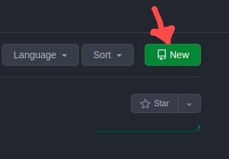
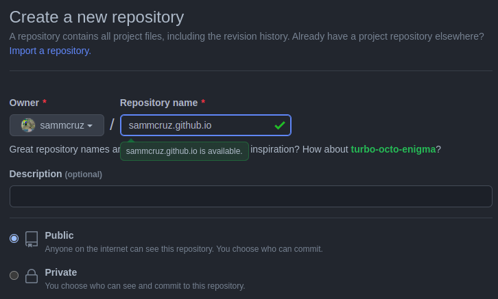
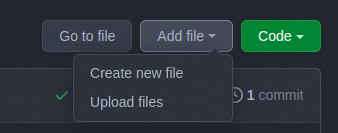

# sammcruz.github.io

<!DOCTYPE HTML PUBLIC "-//W3C//DTD HTML 4.0 Transitional//EN">
<html>
<head>
	<meta http-equiv="content-type" content="text/html; charset=utf-8"/>
	<title></title>
	<meta name="generator" content="LibreOffice 6.4.7.2 (Linux)"/>
	<meta name="created" content="2022-05-01T20:24:08.149793400"/>
	<meta name="changed" content="2022-05-01T21:16:07.669011750"/>
	
</head>
<body lang="pt-BR" text="#FFF" link="#FFF" vlink="#800000" bgcolor="#ffffff" dir="ltr">

Passo
a passo de como
publicar seu portfólio ou website através do GitHub rápido e de
graça!

 

Vamos utilizar a ferramenta <u><a href="https://pages.github.com/">GitHub Pages</a></u>, o site ficará hospedado em um repositório na sua conta do GitHub.

 
 

<u><b>1º Passo:</b> crie um
novo repositório</u>

 
 

Na página inicial do seu GitHub, na aba ‘Repositórios’, clique
no botão verde ‘new.

 
 

Esse repositório deverá ser
nomeado da seguinte maneira: username.github.io

Troque ‘username’ pelo seu
nome de usuário, como
na imagem a seguir

 
 

 
 

<b>Não
esqueça de deixar o repositório público!</b>

 

<u><b>2</b></u><u><b>º
Passo: </b></u><u>crie
</u><u>arquivo
index.html</u>

 
 

Você
pode criar no seu computador e fazer upload diretamente na página do
GitHub ou criar e editar direto pelo GitHub.

O
arquivo index.html é a página principal do seu site. Você também
pode usar folha de estilo ou qualquer outra ferramenta web que
conhecer, é só fazer o upload dos arquivos no seu repositório.

 
 

<u><b>3</b></u><u><b>º
Passo: </b></u><u>acesse
sua página</u>

 
 

Pronto!
Se você chegou até aqui, sua página já está pronta para ser acessada. Pode demorar alguns minutos para atualizar mas o acesso será sempre pelo endereço: <u><b>https://username.github.io</b></u><b>.</b>

Agora
você já pode montar seu portifólio e compartilhar com seus amigos.

 
 

Dica:
crie uma QR com um link que leva para sua página web usando
o https://qr.io/.

</body>
</html>